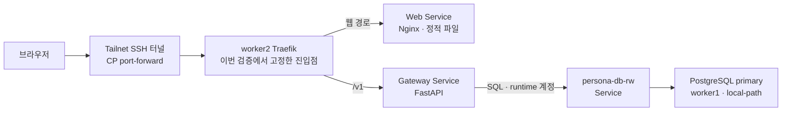
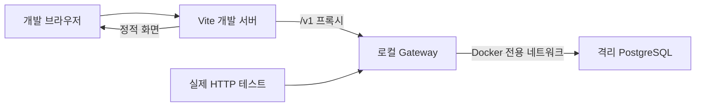

# persona-gateway

사용자 요청의 인증·검증·저장을 담당하는 Python API 서버다.
FastAPI·psycopg·Alembic을 사용하고, 애플리케이션 테이블의 migration을 소유한다.
Go Gateway와 dispatcher는 현재 활성 런타임이 아니다.

## 현재 범위

| 구분             | 기능                                                      |
| ---------------- | --------------------------------------------------------- |
| 운영 확인        | 인증 확인, 캐릭터 목록·생성, health/readiness             |
| 현재 코드에 추가 | 캐릭터 상세 조회, 설정·자료 초안 생성·조회·수정·폐기      |
| 현재 코드에 추가 | 검색 기반 채팅(SSE), vLLM 업스트림 어댑터(`llm` 모드, 실제 GPU 미검증) |
| 미완료           | ingestion 자동 실행, 캐릭터 삭제 전체 흐름                |

2026-09-17 사용자 제공 결과 기준 운영 DB는 `0001_persona_minimal`이다.
초안 API는 `0002_persona_draft` 작업이며 코드 구현과 운영 제공을 구분한다.
사진 업로드는 제외했다.

## 네트워크 흐름

운영에서 확인한 기본 요청 경로다. DB 조회·저장은 Gateway만 수행한다.



이 그림의 터널은 실제 검증에 사용한 접속 방식이다. 진입점 전체의 HA나
Tailscale Serve 경로까지 검증했다는 뜻은 아니다.
Web이 API를 중계하는 것이 아니라 브라우저가 같은 origin의 `/v1`로 요청한다.
미연결 ingestion·Qdrant는 현재 흐름에 포함하지 않는다. vLLM은 `llm` 모드에서 Gateway가
직접 부르는 업스트림이지만, 이 그림의 클러스터에는 아직 붙어 있지 않다.

로컬 개발 경로는 운영 Traefik과 별개다.



## 로컬 실행

Python 3.12 이상과 uv를 사용한다. 실제 HTTP 검증용 스택은 Docker가 필요하며,
`persona-platform`을 이 저장소와 나란히 두어 실제 grants 파일을 사용한다.

```sh
docker build -t persona-minimal-api:local ./python-backend
scripts/local-stack.sh up persona-minimal-api:local
scripts/local-stack.sh url
```

스택은 합성 계정으로 DB를 만들고 migrator로 migration을 적용한 뒤 runtime으로 API를 기동한다.
접속 주소와 합성 토큰은 실행 결과를 사용한다. DB 호스트 포트는 공개하지 않는다.

**up은 기존 소유 스택을 정리하고 새로 만든다. 보존할 데이터가 있는 스택에는 실행하지 않는다.**
검증이 끝났을 때만 아래 명령으로 해당 로컬 스택을 정리한다.

```sh
scripts/local-stack.sh down
```

## 채팅 업스트림

`PERSONA_CHAT_INFERENCE_MODE`가 어떤 어댑터로 답할지 정한다. 기동 시점에 한 번 고르고,
이후 연결이 실패해도 바꾸지 않는다 — LLM이 꺼졌다고 mock으로 넘어가면 합성 문구가 진짜
답변으로 저장된다.

| 값 | 어댑터 | 필요한 설정 |
| --- | --- | --- |
| `mock`(기본) | `FakeInferenceClient` — 모델을 부르지 않는 합성 응답 | 없음 |
| `llm` | `VllmInferenceClient` — vLLM OpenAI 호환 `/v1/chat/completions`(stream) | `PERSONA_VLLM_BASE_URL`, `PERSONA_VLLM_MODEL` |

`llm`인데 위 두 값이 비어 있으면 앱이 **기동하지 못한다**. 선택값으로
`PERSONA_VLLM_API_KEY`(vLLM을 `--api-key`로 띄웠을 때만),
`PERSONA_VLLM_CONNECT_TIMEOUT_SECONDS`(기본 5),
`PERSONA_VLLM_FIRST_TOKEN_TIMEOUT_SECONDS`(기본 60),
`PERSONA_VLLM_IDLE_TIMEOUT_SECONDS`(기본 30)가 있다.

세 timeout은 각각 다른 것을 잰다 — 연결 수립까지, 요청 전송부터 첫 응답 조각까지, 조각
사이의 무응답. 사용자에게 보이는 상한(첫 답변 60초·전체 180초)은 여전히 서비스 계층이
정하고, 이 값들은 그보다 안쪽의 소켓·스트림 보호다.

취소가 보장하는 것은 **Gateway가 업스트림 응답 스트림을 닫고 generation 상태를 정리하는
것**까지다. vLLM 쪽 모델 연산이 즉시 멈추는지는 보장하지 않는다. 브라우저가 연결을 끊는
경우는 취소가 아니라 `reconciling`으로 남으므로, 시간 예산이 만료될 때까지 업스트림
연결이 유지된다.

## 메트릭

`/metrics`가 Prometheus 형식으로 노출한다(인증 없음, 운영 엔드포인트).
label에는 route 템플릿·method·상태 코드·결과처럼 가짓수가 작은 값만 넣는다.
사용자·대화 ID, Idempotency-Key, 본문, 토큰, 예외 메시지는 넣지 않는다.

| 이름 | type | label | 단위 |
| --- | --- | --- | --- |
| `persona_http_requests_total` | Counter | method, route, status, outcome | 건 |
| `persona_http_request_duration_seconds` | Histogram | method, route, status_class, outcome | 초 |
| `persona_http_requests_in_flight` | Gauge | 없음 | 건 |
| `persona_gateway_build_info` | Info(gauge=1) | version, revision | — |
| `persona_chat_generations_started_total` | Counter | mode | 건 |
| `persona_chat_generations_finished_total` | Counter | mode, terminal_reason | 건 |
| `persona_chat_time_to_first_token_seconds` | Histogram | 없음 | 초 |
| `persona_chat_generation_seconds` | Histogram | 없음 | 초 |
| `persona_retrieval_seconds` | Histogram | kind_group | 초 |

- `route`는 `/v1/generations/{generation_id}/cancel` 같은 템플릿이고, 매칭된 라우트가
  없으면 `unmatched`다.
- `outcome`은 `completed`·`client_disconnected`·`exception` 세 값뿐이며 counter와
  histogram 모두에 붙는다. **일반 API 지연은 반드시 `outcome="completed"`로 조회한다.**
  끊긴 요청의 지연은 끊긴 시점까지의 시간이라 `outcome="client_disconnected"`로 따로 본다.

  ```promql
  # 정상 완료 요청의 route별 p99
  histogram_quantile(0.99, sum by (le, route) (
    rate(persona_http_request_duration_seconds_bucket{outcome="completed"}[5m])))
  ```
- 응답 전에 끊기면 status를 `499`, 응답 전 예외면 `500`으로 적는다.
- `/metrics` 요청 자체는 세지 않는다.
- HTTP 지연 버킷은 짧은 API와 채팅 한도(60·180초)를 구분하도록 0.005초에서 300초까지다.
- 채팅 histogram은 기본 버킷(상한 10초)에서 0.1~180초 버킷으로 바꿨다. 버킷 경계가
  달라졌으므로 이 변경 이전 수집분과 `_bucket`을 섞어 비교하지 않는다.
- TTFT는 스트림 시작부터 사용자 텍스트가 담긴 첫 `delta`까지다. meta·citations는 TTFT가
  아니며, 검색 시간은 포함된다.
- `revision`은 이미지 빌드 인자로 넣는다. Git hash 형식이 아니면 `unknown`이다.

  ```sh
  docker build --build-arg GIT_REVISION="$(git rev-parse HEAD)" \
    -t persona-minimal-api:local ./python-backend
  ```

- Prometheus는 30초 간격으로 수집한다(persona-platform PodMonitor). 롤아웃 순간의
  짧은 오류는 카운터 증가로는 남지만 in-flight 같은 gauge는 30초 해상도로만 보인다.

## 검증

계약 검사는 저장소 루트에서, Python 검사는 `python-backend`에서 실행한다.

```sh
python3 api/validate_contract.py
cd python-backend
uv sync --locked
uv run --with ruff ruff check .
uv run --with ruff ruff format --check .
uv run pytest
```

실제 PostgreSQL 통합 검사는 격리 DB와 Docker 등 테스트 전제를 확인해야 한다.
테스트의 passed·skipped·error를 구분하고, 이미지 안의 migration과 소스가 일치하는지도 확인한다.
위 Ruff 실행은 도구를 임시로 공급하므로 네트워크 또는 캐시가 필요할 수 있다.

## 데이터·운영 경계

- migrator는 migration DDL, runtime은 앱에 필요한 제한된 SQL 권한만 사용한다.
- 앱 기동 시 migration을 자동 실행하지 않는다.
- 운영 설정은 `DATABASE_URL`, `PERSONA_EMBEDDING_URL`, `PERSONA_STATIC_BEARER_TOKEN`,
  `PERSONA_STATIC_USER_ID`, `PERSONA_STATIC_DISPLAY_NAME`, `PERSONA_CURSOR_SIGNING_KEY`로
  공급한다. 실제 값은 공개하지 않는다.
- 채팅 업스트림은 `PERSONA_CHAT_INFERENCE_MODE`로 고른다(`mock` 기본, `llm`). 아래
  "채팅 업스트림" 참고.
- `/healthz`는 프로세스 생존, `/readyz`는 필수 스키마·revision과 DB 연결 상태를 확인한다.
- DB 장애가 곧바로 앱 재시작으로 이어지도록 liveness를 설계하지 않는다.
- 로컬 스택 검증은 운영 migration·배포 승인이 아니다.
