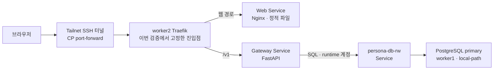
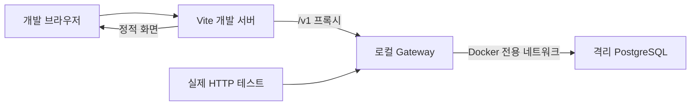

# persona-gateway

사용자 요청의 인증·검증·저장을 담당하는 Python API 서버다.
FastAPI·psycopg·Alembic을 사용하고, 애플리케이션 테이블의 migration을 소유한다.
Go Gateway와 dispatcher는 현재 활성 런타임이 아니다.

## 현재 범위

| 구분             | 기능                                                      |
| ---------------- | --------------------------------------------------------- |
| 운영 확인        | 인증 확인, 캐릭터 목록·생성, health/readiness             |
| 현재 코드에 추가 | 캐릭터 상세 조회, 설정·자료 초안 생성·조회·수정·폐기      |
| 미완료           | ingestion 자동 실행, 검색·LLM 채팅, 캐릭터 삭제 전체 흐름 |

2026-09-17 사용자 제공 결과 기준 운영 DB는 `0001_persona_minimal`이다.
초안 API는 `0002_persona_draft` 작업이며 코드 구현과 운영 제공을 구분한다.
사진 업로드는 제외했다.

## 네트워크 흐름

운영에서 확인한 기본 요청 경로다. DB 조회·저장은 Gateway만 수행한다.



이 그림의 터널은 실제 검증에 사용한 접속 방식이다. 진입점 전체의 HA나
Tailscale Serve 경로까지 검증했다는 뜻은 아니다.
Web이 API를 중계하는 것이 아니라 브라우저가 같은 origin의 `/v1`로 요청한다.
미연결 ingestion·Qdrant·vLLM은 현재 흐름에 포함하지 않는다.

로컬 개발 경로는 운영 Traefik과 별개다.



## 로컬 실행

Python 3.12 이상과 uv를 사용한다. 실제 HTTP 검증용 스택은 Docker가 필요하며,
`persona-platform`을 이 저장소와 나란히 두어 실제 grants 파일을 사용한다.

```sh
docker build -t persona-minimal-api:local ./python-backend
scripts/local-stack.sh up persona-minimal-api:local
scripts/local-stack.sh url
```

스택은 합성 계정으로 DB를 만들고 migrator로 migration을 적용한 뒤 runtime으로 API를 기동한다.
접속 주소와 합성 토큰은 실행 결과를 사용한다. DB 호스트 포트는 공개하지 않는다.

**up은 기존 소유 스택을 정리하고 새로 만든다. 보존할 데이터가 있는 스택에는 실행하지 않는다.**
검증이 끝났을 때만 아래 명령으로 해당 로컬 스택을 정리한다.

```sh
scripts/local-stack.sh down
```

## 검증

계약 검사는 저장소 루트에서, Python 검사는 `python-backend`에서 실행한다.

```sh
python3 api/validate_contract.py
cd python-backend
uv sync --locked
uv run --with ruff ruff check .
uv run --with ruff ruff format --check .
uv run pytest
```

실제 PostgreSQL 통합 검사는 격리 DB와 Docker 등 테스트 전제를 확인해야 한다.
테스트의 passed·skipped·error를 구분하고, 이미지 안의 migration과 소스가 일치하는지도 확인한다.
위 Ruff 실행은 도구를 임시로 공급하므로 네트워크 또는 캐시가 필요할 수 있다.

## 데이터·운영 경계

- migrator는 migration DDL, runtime은 앱에 필요한 제한된 SQL 권한만 사용한다.
- 앱 기동 시 migration을 자동 실행하지 않는다.
- 운영 설정은 `DATABASE_URL`, `PERSONA_STATIC_BEARER_TOKEN`, `PERSONA_STATIC_USER_ID`,
  `PERSONA_STATIC_DISPLAY_NAME`, `PERSONA_CURSOR_SIGNING_KEY`로 공급한다. 실제 값은 공개하지 않는다.
- `/healthz`는 프로세스 생존, `/readyz`는 필수 스키마·revision과 DB 연결 상태를 확인한다.
- DB 장애가 곧바로 앱 재시작으로 이어지도록 liveness를 설계하지 않는다.
- 로컬 스택 검증은 운영 migration·배포 승인이 아니다.
